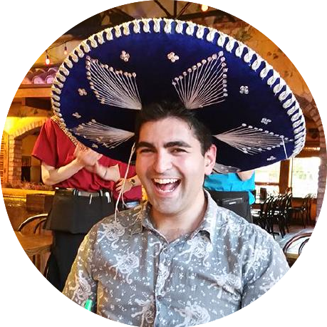

  

<h1 align="center">Personal Handbook</h1>

  <b>Who I am • What I value • How I like to work</b>

 

## Location & Timezone

I usually work [U.S. Central Time](https://time.is/CT). Sometimes I travel. Please ask me if you're not sure of my current timezone.

## Core Values

### Do Good Work

Create "Good Karma" in the universe. You should always feel comfortable telling your parents about what we do and how we do it.

### Play to Win

Winning is very different than not losing. If we're going to play the game, play the game to win!

### Extreme Ownership

Take [Extreme Ownership](https://youtu.be/BTMgXdT0mQM) of your actions and your work. Deliver on your commitments. Speak up if something's changed and you can't deliver anymore. We’re in this together as a team.

### Pay It Forward

Empower others to reach their goals. Spread knowledge fast. Teach others what you know. Learn new things.

### Keep It Fun

Act with kindness and love. Find the joy. Leave people with happy memories.

## My Style

### Put the Bottom Line Up Front

Be clear and direct with your communications. [Skip the “hello”](https://nohello.net) and get down to business. Put the [bottom line up front](https://en.wikipedia.org/wiki/BLUF_(communication)). Leave no room for confusion or doubt about what you need.

### Maximize ROI

Focus on value. Care more about Outputs than Inputs. Leverage your resources. Use [force multipliers](https://en.wikipedia.org/wiki/Force_multiplication). Do more with less. 

### Done Is Better Than Perfect

Perfection takes too long. Iterate often. Keep the [feedback loop](https://en.wikipedia.org/wiki/OODA_loop) as short as possible. [Disagree and commit](https://www.amazon.jobs/principles) when needed.

### Use the Best Tool for the Job

Don’t put [square pegs in round holes](https://en.wikipedia.org/wiki/Square_peg_in_a_round_hole). Use the best tool for the job.

### Document Everything

Share knowledge quickly. Have a single "Source of Truth" for what to do and how to do it.

### Kill Sacred Cows

There are no [sacred cows](https://en.wikipedia.org/wiki/Sacred_cow_(idiom)) here. Start from [First Principles](https://en.wikipedia.org/wiki/First_principle) and try everything. Keep what works, discard the rest.

## Work Hours

### I Don’t Track How You Work

My focus is on the [value](#maximize-roi) we bring to our clients and customers. If you can do that in 24 minutes while sitting on a park bench in Zurich, then do it!

### Make Team Communication Easy

Be clear with your team about when you're working and coordinate as needed. Use the tools we have and keep communication asynchronous.

### Shift Your Workday as Needed

We want high-quality work at all times and this won’t happen if you're burnt out. Shift your workday and take time off as needed. But please make sure there is no impact on the needs of your teams, your projects, or the quality of your results.

### Don’t Work on Vacation

Please don't work when you're on vacation. Take care of yourself and your family. Get some sleep. Eat well. Visit nature and unplug. Work hard when it’s time to work and enjoy the time off when you have time off. This is both healthy for you and keeps scheduling clear and clean with the team.

## About Me

Hi there, welcome to my handbook! :wave:

This document details who I am, what I value, and how I like to work. Hat tip to [Leah Fessler](https://qz.com/1046131/writing-a-user-manual-at-work-makes-teams-less-anxious-and-more-productive/) and [Abby Falik](https://www.linkedin.com/pulse/leaders-need-user-manuals-what-i-learned-writing-mine-abby-falik) for the idea.

I'm the author of 5 LinkedIn Learning courses like [_Angular: Testing and Debugging_](https://www.linkedin.com/learning/angular-testing-and-debugging-10201318) and [_Angular: Ecosystems_](https://www.linkedin.com/learning/angular-ecosystems).

I was born and raised in New York City during the height of the “Silicon Alley” tech boom. My lifelong connection to New York City shaped how I solve large-scale challenges like performance, scaling, automation, and deployment.

Fortune 500 and Forbes Global 2000 companies like Pfizer and Thomson Reuters are making up to $536 million* over the next year with the help of my easy-to-use software solutions. These solutions were built up from over 12 years of real-world wins with teams, product owners, and clients like you.

I have a lot of contract negotiation experience working with clients and vendors. I studied many negotiation techniques, including strategies taught at the University of Michigan Law School and the FBI Crisis Negotiation Unit.

My BFA in theater and performance gives me expert-level communication skills and makes my the ideal bridge between technical and non-technical team members.

I'm also a real estate investor and a student of the FortuneBuilders Mastery Coaching Program.
